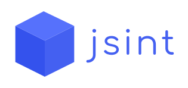

<h1 align="center">🕹️ jsint </h1>

 

  <b>Keep control and manage tasks using code and buttons</b>
 

 

  
 

 

  <kbd><a href="https://github.com/hipesoft/jsint/issues/new?assignees=&labels=bug&template=bug_report.md&title=Bug+report"><b>Report a bug</b></a></kbd>
  &nbsp; &nbsp;
  <kbd><a href="https://github.com/hipesoft/jsint/issues/new?assignees=&labels=enhancement&template=feature_request.md&title=Feature+request"><b>Request a feature</b></a></kbd>

  

